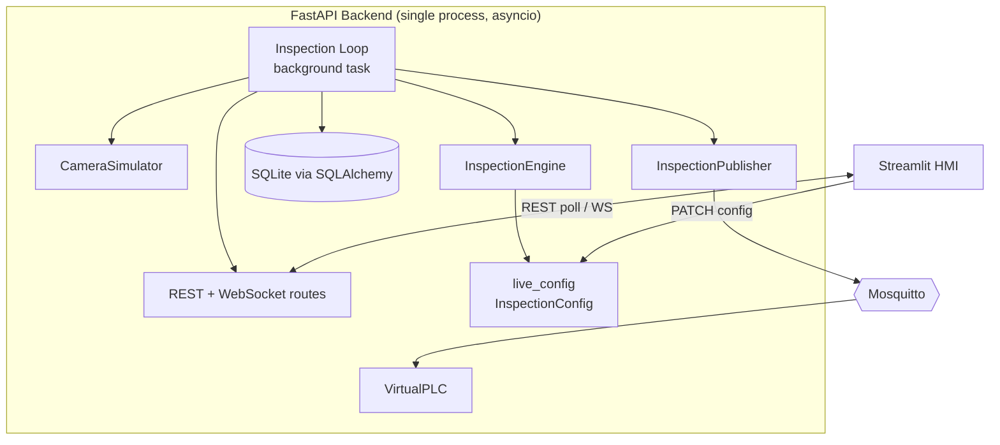
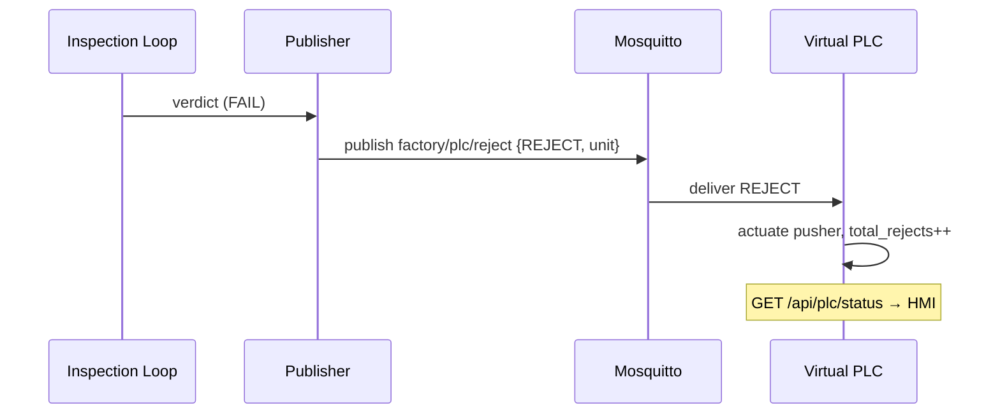

# Architecture

This document describes the runtime design of the Industrial Quality Inspection
system: how frames flow from the simulated camera through the hybrid inference
engine to persistence, MQTT/PLC actuation and the operator HMI.

## 1. Component Map

The backend is **one asyncio process**. The inspection loop is a background
`asyncio.Task`; CPU-bound stages (frame synthesis, OpenCV, YOLO, DB writes,
JPEG encoding) are dispatched to a thread pool via `asyncio.to_thread` so the
event loop — which serves REST and WebSocket clients — never blocks.

## 2. Frame Lifecycle

One iteration of `inspection_loop` ([backend/app/main.py](backend/app/main.py)):

1. **Acquire** — `CameraSimulator.grab_frame()` renders a synthetic part (or
   reads from `QI_FRAME_DIR`) and returns a `Frame` carrying the image plus
   ground-truth defects and nominal/actual radius.
2. **Inspect** — `InspectionEngine.inspect(frame, live_config)` runs the hybrid
   pipeline (§3) and returns detections, a pass/fail verdict, confidence,
   cycle time and an annotated frame.
3. **Archive** — failed units are written to `data/archive/<date>/<unit>.jpg`
   for retraining datasets.
4. **Persist** — a row is inserted into `inspection_results` (verdict, defect
   JSON, confidence, cycle time, image path).
5. **Publish** — the verdict is published to `factory/inspection/results`; if
   the unit failed and PLC output is enabled, a `REJECT` command goes to
   `factory/plc/reject`.
6. **Surface** — the annotated frame is JPEG+base64 encoded, cached as
   `latest_frame`, and broadcast to all WebSocket subscribers.

Cadence is governed by `CAMERA_FPS` (default 2 fps).

## 3. Hybrid Inference Engine

[backend/app/inference.py](backend/app/inference.py) combines two detector
families and reconciles them. The active mix is selectable at runtime
(`active_model`: `hybrid` | `yolo_only` | `opencv_only`).

### 3.1 Classical OpenCV (high-speed, deterministic)

| Detector | Technique | Target defect |
| --- | --- | --- |
| `_segment_part` | Gray threshold + morphology + largest contour | Part isolation vs. dark belt |
| `detect_stains` | HSV **saturation** threshold → blob contours ≥ min area | Stain / oil / rust |
| `detect_scratches` | Part-masked **Canny → probabilistic Hough** lines + NMS | Scratch |
| `detect_dimensional` | `minEnclosingCircle` radius vs. nominal; centroid offset | Dent (size), Misalignment (position) |

These run in single-digit milliseconds and provide the **dimensional gates**
that deep learning alone handles poorly.

### 3.2 YOLO11 (surface defects)

`_YoloRunner` lazily loads Ultralytics YOLO when `YOLO_ENABLED=true`. Real
detections are mapped into the common `Detection` schema. When weights are
absent it falls back to a **deterministic mock** seeded by the unit id, which
derives plausible surface detections (scratch/stain/missing_component) from the
camera ground truth — so the full pipeline, dashboard and PLC path are
demonstrable without a GPU. Dent/misalignment are intentionally left to the
OpenCV dimensional gate, keeping the two sources complementary.

### 3.3 Decision Merger

All detections (both sources) pass through class-aware **non-max suppression**
(`_nms`, IoU 0.45) to remove duplicates where OpenCV and YOLO agree. The
verdict is `len(detections) <= max_defects_to_pass`. Confidence is the mean
detection confidence (or 0.99 for a clean unit).

## 4. Configuration Model

[backend/app/config.py](backend/app/config.py) splits configuration into:

- **`Settings`** — static deployment values from environment variables (MQTT
  host/port, FPS, defect rate, YOLO toggle, paths). Read once at boot.
- **`live_config: InspectionConfig`** — a single process-wide, **mutable**
  Pydantic model holding operator-tunable thresholds. `PATCH /api/config`
  mutates it and re-validates; the very next loop iteration reflects the change.
  This is the calibration surface an industrial vision system exposes.

## 5. MQTT / PLC State Machine

[backend/app/mqtt_client.py](backend/app/mqtt_client.py) hosts two paho-mqtt
clients:

- **`InspectionPublisher`** (`vision-controller`) — publishes verdicts (QoS 0)
  and reject commands (QoS 1). If the broker is unreachable it silently
  degrades to a no-op, so plant-network hiccups never stall inspection.
- **`VirtualPLC`** (`virtual-plc`) — subscribes to `factory/plc/reject`. On a
  `REJECT` it "actuates the pusher": increments `total_rejects`, records the
  unit and timestamp, and logs the action. This state feeds the dashboard's
  PLC monitor via `GET /api/plc/status`.

## 6. API Surface

| Method | Path | Purpose |
| --- | --- | --- |
| GET | `/health` | Liveness + subsystem status (mqtt/plc/yolo) |
| GET | `/api/frame/latest` | Latest annotated frame (base64 JPEG) + verdict |
| GET | `/api/stats` | KPI aggregates + defect breakdown |
| GET | `/api/logs?limit=` | Recent inspection rows |
| GET | `/api/config` | Current live config |
| PATCH | `/api/config` | Partial config update (validated) |
| GET | `/api/plc/status` | Virtual PLC actuator state |
| POST | `/api/control/{pause\|resume}` | Start/stop the line |
| WS | `/ws/stream` | Push every verdict to dashboards |

## 7. Operator HMI

[frontend/app.py](frontend/app.py) is a thin client: it polls the REST API on a
timed auto-refresh and renders a dark control-room theme (injected CSS) with KPI
tiles, status LEDs, the live feed, an animated reject banner, a defect-breakdown
chart and a downloadable inspection log. All logic lives in the backend; the HMI
holds no business rules.

## 8. Deployment Topology

`docker-compose.yml` orchestrates three services on a shared network:
`mqtt` (eclipse-mosquitto) → `backend` (FastAPI/uvicorn, `/data` volume for DB +
archive) → `frontend` (Streamlit). Backend and frontend resolve the broker and
each other by service name. Health checks gate readiness.

## 9. Design Trade-offs

- **Single-process backend** keeps the demo simple and the shared `live_config`
  trivially consistent. A production line would split acquisition, inference and
  the MQTT bridge into separate workers behind a frame queue (Redis/ZeroMQ).
- **SQLite** is ideal for a single-station audit log; swap the SQLAlchemy URL
  for Postgres to centralise multiple stations.
- **Mock-YOLO fallback** trades real accuracy for zero-dependency
  demonstrability, while preserving the exact data path real weights would use.
- **Polling HMI** (vs. consuming the WebSocket) maximises Streamlit robustness;
  the WS endpoint is provided for lower-latency custom clients.
