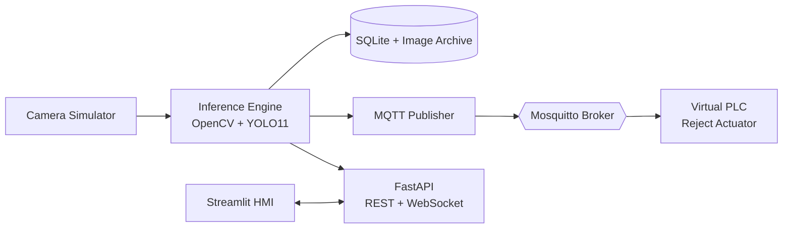

<div align="center">

# 🏭 Industrial Quality Inspection System

**Real-time computer-vision defect detection for a simulated factory conveyor line.**

Hybrid **OpenCV + YOLO11** inference · **FastAPI** backend · **MQTT/PLC** integration · premium **Streamlit** operator HMI · fully **Dockerized**.


</div>

---

## Overview

This project simulates an end-to-end industrial machine-vision station. Products
(metal bearings) travel down a virtual conveyor; each unit is photographed by a
simulated GigE camera, inspected for **scratches, dents, missing components,
stains and misalignments**, and either passed or rejected. Rejects trigger a
**virtual PLC pneumatic pusher** over MQTT. Every verdict is persisted, defect
images are archived for retraining, and the whole line is monitored and tuned
from a real-time operator dashboard.

It runs **end-to-end with zero trained weights and no GPU** thanks to a
deterministic mock-YOLO fallback — yet drops straight into real YOLO11
inference by setting one environment variable.

## Key Features

| Domain | Capability |
| --- | --- |
| 🧠 **Hybrid inference** | Classical OpenCV (Canny/Hough scratches, HSV stains, dimensional gates) fused with YOLO11 surface-defect detection via non-max suppression. |
| 🎥 **Camera simulator** | Procedurally renders brushed-metal parts on a conveyor and injects realistic defects, or streams a real image directory (`QI_FRAME_DIR`). |
| 🤖 **PLC over MQTT** | Vision controller publishes verdicts and reject commands; a virtual PLC subscribes and actuates the rejector. |
| 🗄️ **Audit trail** | SQLite telemetry (verdict, defects, bboxes, cycle time) + dated defect-image archive. |
| 🎛️ **Live tuning** | Operator panel adjusts thresholds, tolerances, active model and PLC output with instant effect. |
| 📊 **Premium HMI** | Dark control-room Streamlit dashboard: live feed, KPI tiles, status LEDs, animated reject monitor, downloadable logs. |

## Architecture



See [ARCHITECTURE.md](ARCHITECTURE.md) for the deep dive and [WIKI.md](WIKI.md)
for setup, CV tuning and the API reference.

## Quick Start (Docker)

```bash
docker compose up --build
```

Then open:

- **Operator HMI** → http://localhost:8501
- **Backend API docs** → http://localhost:8000/docs
- **MQTT broker** → `localhost:1883`

The conveyor starts immediately. Watch the live feed, flip thresholds in the
sidebar, and see the reject monitor flash when a defective unit is pushed.

## Quick Start (local, no Docker)

```bash
# 1. Backend
cd backend
pip install -r requirements.txt
uvicorn app.main:app --reload          # http://localhost:8000

# 2. Frontend (new terminal)
cd frontend
pip install -r requirements.txt
streamlit run app.py                    # http://localhost:8501
```

> Without a broker the system runs in **degraded MQTT mode** — inspection,
> persistence and the dashboard all work; only the cross-process PLC bridge is
> inactive. Start a local Mosquitto for the full experience.

## Enabling real YOLO11

```bash
# In backend/requirements.txt, uncomment:  ultralytics==8.3.40
pip install ultralytics
# Drop weights in data/models/ and set:
export YOLO_ENABLED=true
export YOLO_WEIGHTS=data/models/best.pt   # or yolo11n.pt to auto-download
```

The engine swaps the mock for live inference with no code changes.

## Tests

```bash
cd backend
pip install pytest
pytest -q
```

## Project Layout

```
backend/   FastAPI app — config, db, inference, camera, mqtt, main
frontend/  Streamlit operator HMI
infra/     Mosquitto broker config
docker-compose.yml
```

## License

MIT — provided as a reference/demonstration of an industrial CV inspection pipeline.
